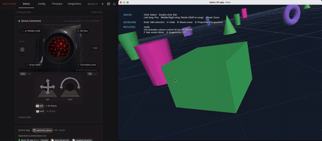

# OpenAxis

OpenAxis connects Rotatrix input to your application over a local WebSocket
connection. This repository contains the protocol specification, SDKs for Python,
C#, TypeScript and C++, and runnable integration examples.

[](https://openaxis.rotatrix.com/)

[Watch the full demo](https://openaxis.rotatrix.com/).

The Rotatrix server handles device input and the user's navigation profile. Your
integration connects through an SDK and applies input to your application's native
APIs. It can receive server-computed camera and object poses through Navigation,
or interpret logical axis rates through Axis Streaming.

**Release status:** OpenAxis 1.0 Release Candidate 1. See
[compatibility and language support](https://openaxis.rotatrix.com/reference/language-support/)
for supported environments and versioning.

## Start building

The [documentation](https://openaxis.rotatrix.com/) explains the two interfaces
and guides you through building an integration. Start with the
[Navigation quickstart](https://openaxis.rotatrix.com/guide/navigation-quickstart/)
for a 3D application, or the
[Axis Streaming quickstart](https://openaxis.rotatrix.com/guide/axis-streaming/)
for application-defined input behavior.

Use [SDK installation](https://openaxis.rotatrix.com/guide/sdk-installation/)
for package and source setup, and try the
[interactive demos](https://openaxis.rotatrix.com/demos/) to see navigation in
a working application. Device input requires Rotatrix running locally and a
connected device.

## Repository contents

| Path | Contents |
| --- | --- |
| [SPEC.md](SPEC.md) | Authoritative wire protocol specification |
| [py/openaxis/](py/openaxis/README.md) | Python SDK |
| [cs/](cs/README.md) | C# SDK |
| [ts/sdk/](ts/sdk/README.md) | TypeScript SDK |
| [cpp/](cpp/README.md) | C++ SDK |
| [examples/](examples/README.md) | Runnable applications and browser demos |
| [fixtures/](fixtures/openaxis-1.0/README.md) | Shared conformance scenarios |
| [docs/](docs/README.md) | Documentation source and site tooling |

## Development

Use Node 22.12+ and the pnpm version pinned in `package.json`. Install the
toolchains for the languages you want to work on: uv for Python, .NET SDK 8+
for C#, or CMake 3.24+ and a C++17 compiler for C++. Native demos also need
the graphics dependencies described in their example READMEs.

From this repository's root:

```sh
pnpm install --frozen-lockfile
pnpm build          # build SDKs, documentation and demos
pnpm test           # run automated tests
pnpm demo           # choose, build and launch a demo
```

To work on one language, use commands such as `pnpm build cs` or
`pnpm test python`. The language selectors are `typescript`, `python`, `cs`
and `cpp`. Start Rotatrix separately before trying device input in a demo.

See [SDK architecture](docs/src/content/docs/contributing/sdk-architecture.md)
for implementation guidance, [release testing](docs/src/content/docs/contributing/release-testing.md)
for validation requirements, and [manual demo checks](examples/ACCEPTANCE.md)
for interactive testing. For local documentation preview and browser demo
development, see [documentation tooling](docs/README.md).

## Connection security

Review the protocol's [security and privacy considerations](SPEC.md#12-security-and-privacy-considerations)
when connecting applications or enabling browser access.

## Licensing

OpenAxis is dual-licensed under ELv2 or GPLv3. Integrations for proprietary
applications must use the SDK under ELv2. See [legal notices](LEGAL.md) for details.
