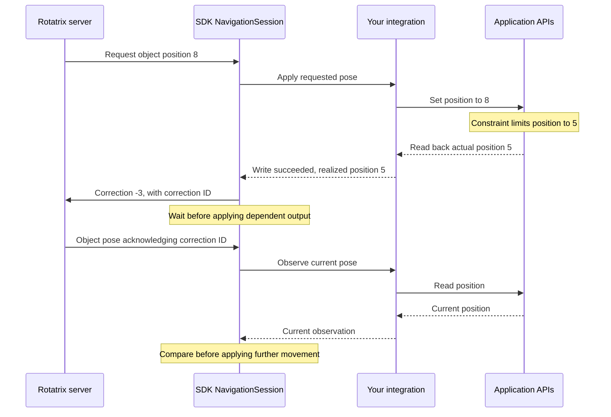

The server sends target camera or object poses, but the application may end up
elsewhere. A native mouse gesture can move the camera, or snapping, limits and
collisions can constrain a requested position. Reconciliation tells Rotatrix
about the actual result so subsequent navigation continues from that state.

## Requested, observed, and realized poses

- **Requested pose:** what Rotatrix asked the application to apply.
- **Observation:** a pose read from the application.
- **Realized pose:** an observation after a successful native write.

Your integration supplies observations and write results. The SDK's
NavigationSession compares them with the requested movement and handles
corrections to Rotatrix.

## A normal correction

Suppose Rotatrix requests object position `8`, but an application constraint
limits it to `5`:

1. The integration applies the request and reports the actual position, `5`.
2. The SDK reports the difference, `-3`, to Rotatrix.
3. The SDK waits for Rotatrix to acknowledge the correction before applying
   output that depends on it.
4. Navigation continues from the application's actual state.

The acknowledgement arrives on a subsequent object pose. The SDK checks it
against the current observation before writing again; if they already match,
no additional native write is needed.

The same process handles movement from native input. Your integration reports
what happened; the SDK keeps older navigation output from undoing that change.

## What your integration provides

Read and write poses on the application's permitted thread. Return the pose
actually realized after a write and notify the session when native input changes
the camera or object. Configure observation callbacks for the targets whose
independent movement you need to track. The [concurrent input recipe](/guide/concurrent-input/)
shows the wiring; the [adapter reference](/reference/navigation-hosts/#writes-and-observations)
defines when camera and object observations participate.

Only meaningful differences should cause corrections. For example, a native
camera may normalize its representation without changing the visible view.
Use the SDK's comparison options to express that equivalence and avoid repeated
corrections for invisible changes.

## Unknown readback

A setter can succeed even when the resulting pose cannot be read. Report success
with an unknown result in that case. When observations resume, the SDK can
compare the actual pose with the last successful request and correct any
difference. This recovery requires an observation to become available.

See [readback recovery](/reference/navigation-coordination/#unknown-readback)
for the exact baseline rules.

## Projection changes

Switching between perspective and orthographic views changes more than the
camera's position and orientation. The SDK reports the new camera and projection
and waits for acknowledgement before continuing dependent output. Keep the
reported projection consistent with the rendered view.

See [projection changes](/reference/navigation-coordination/#projection-changes)
for the message sequence.

## Skipping and retaining work

If input arrives faster than the application can apply it, the SDK retains the
newest pending pose instead of replaying a backlog. Queries and pivot changes
retain their ordering. Closing or replacing a target invalidates work for it;
queued output must never affect a replacement viewport or object.

## Failure boundaries

A failed native write or invalid target cancels the gesture. Optional pivot
rendering and diagnostics stay separate from whether a pose was successfully
applied. Keep application-specific timeouts around remote native operations.

The [navigation coordination reference](/reference/navigation-coordination/)
covers correction barriers, custom-coordinator calculations, queue limits and
exact failure behavior.
